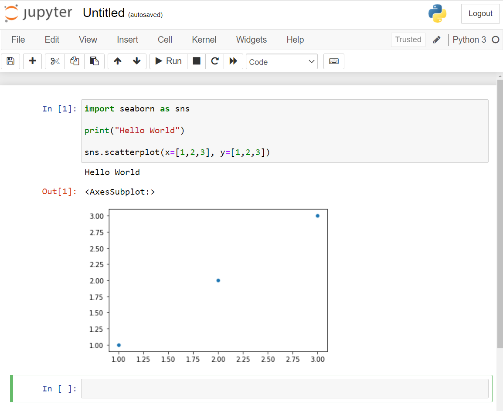

# Installation instructions
For this course you need a working installation of Python along with some required packages. This is made easy by the *Anaconda* distribution, which provides a current Python version bundled together with many popular packages for Data Science. Anaconda also provides you with the *conda* package manager, which you can use to install additional Python packages.

To install Anaconda, follow [this link](https://www.anaconda.com/products/individual) to download the installer and use default settings for everything.

On a Windows computer you should now have an installed program named *Anaconda Prompt*. On Mac you can just use the regular *Terminal* window. Next, type the following commands in the Anaconda Prompt / Terminal:

```shell
conda activate base

jupyter notebook
```

Now, the Jupyter application should open in your webbrowser. Next, switch to some random folder on the Jupyter interface and then click on `New`→`Python 3`.

Now, a Jupyter Notebook with a single code cell should open. Click into the code cell and enter the following code which will test if your installation works as intended:

```python
import seaborn as sns

print("Hello World")

sns.scatterplot(x=[1,2,3], y=[1,2,3])
```

Click on the `▶ Run` button. Your output should now look like this:

<div>

</div>

If it does, congratulations! You now have a working installation of Python with a lot of packages required for scientific computing. You can now close the Anaconda Prompt / Terminal again to shutdown Jupyter and you can also delete the `.ipynb_checkpoints` folder which Jupyter automatically created in the folder in which you created the new file.

If something went wrong in the installation and you cannot figure it out, feel free to message Leonhard or me on the course discord.